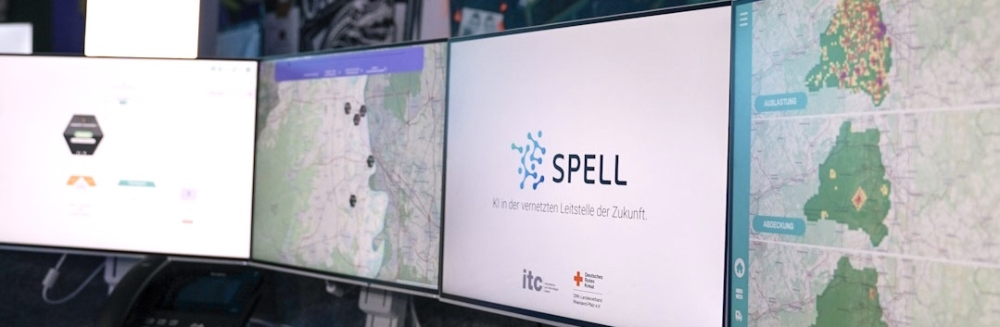

	
	<h1>Forschung und Lehre </h1>
	
Eine Abteilung des <a href="https://itc.drk.de/" target="_blank">Informations- und Technologie Centers</a> des <a href="https://www.drk-rlp.de/" target="_blank">Deutschen Roten Kreuz Rheinland Pfalz e.V.</a>

	<small><a href="#english-version">(English Version below)</a></small>

Innerhalb des ITCs kümmert sich diese Abteilung insbesondere um Forschungsprojekte.

### Was wir machen

Unser momentaner Fokus liegt auf dem [SPELL Projekt](https://spell-plattform.de/), in welchem wir zusammen mit anderen Projektpartner:innen die Leitstelle der Zunkunft mitentwickeln wollen. Dabei unterstützt die SPELL-Plattform Disponent:innen bei der Entscheidungsfindung, aber vernetzt auch die Leitstellen miteinander. 

### Wie man uns erreicht

Für (An-)Fragen jeglicher Art sind wir jederzeit unter FuL@itc.drk.de erreichbar.

## English Version

As part of the ITC, this department mainly focuses on research projects.

### What we do

Our focus at the time is on the [SPELL-Project](https://spell-plattform.de/en/spell-plattform/), in which we work together with different project partners to develop the dispatch center of the future. The SPELL-Platform supports dispatchers in their decision-making process, but will also interconnect the different centers.

### How to reach us

Für any kind of inquiry or request, you can reach us at FuL@itc.drk.de.

## Credits
Banner - :camera: by [Luisa Maria Schmidt](https://luisamariaschmidt.de/)